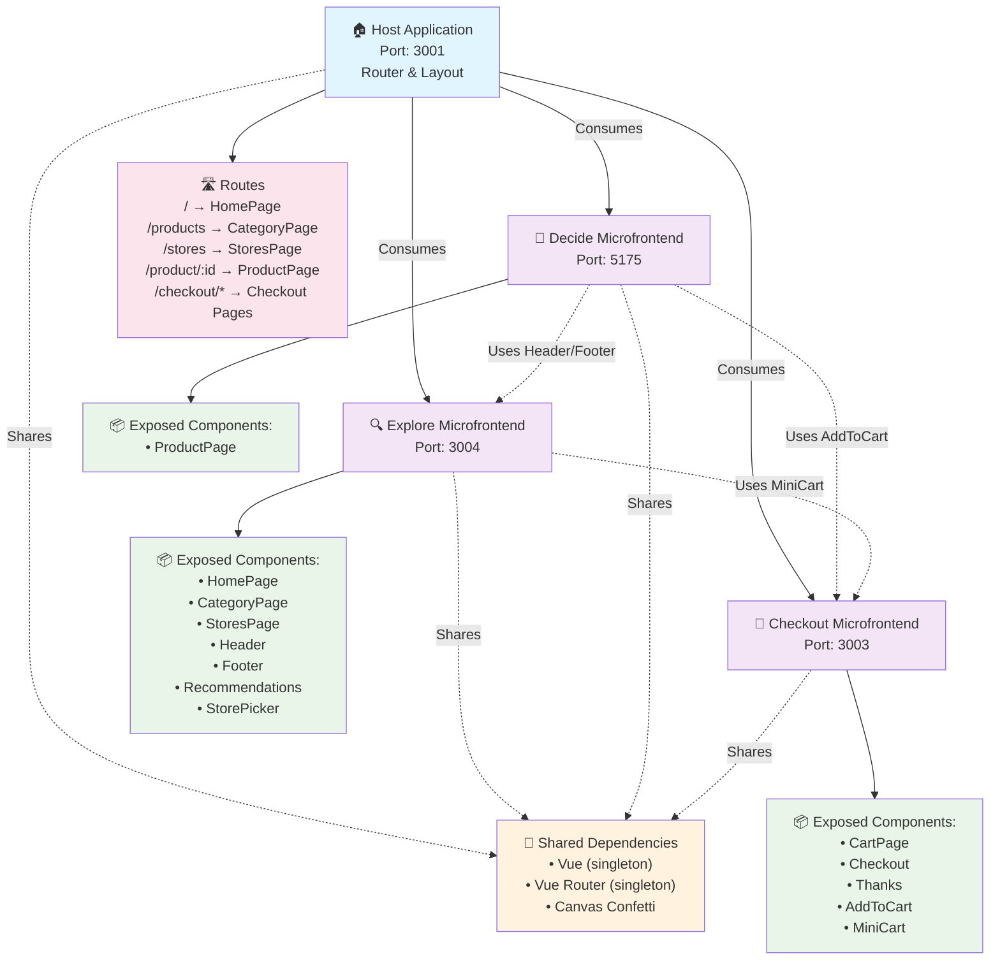

# The Tractor Store - Vue 3 Module Federation

A micro frontends sample implementation of [The Tractor Store](https://micro-frontends.org/tractor-store/) built with Vue 3, TypeScript and Module Federation using pnpm workspaces. It's based on the [Blueprint](https://github.com/neuland/tractor-store-blueprint).

**Live Demo:** [http://localhost:3001](http://localhost:3001) (when running locally)

## About This Implementation

### Technologies

List of techniques used in this implementation.

| Aspect                     | Solution                                  |
| -------------------------- | ----------------------------------------- |
| 🛠️ Frameworks, Libraries   | [Vue 3], [Vue Router], [TypeScript], [Rsbuild] |
| 📦 Package Manager         | [pnpm] with workspaces                    |
| 🏗️ Monorepo Structure      | apps/ and packages/ with shared components |
| 📝 Rendering               | SPA with CSR                              |
| 🐚 Application Shell       | Host Application (Shell Pattern)         |
| 🧩 Client-Side Integration | [Module Federation] via [@module-federation/enhanced] |
| 🧩 Server-Side Integration | None                                      |
| 📣 Communication           | Custom Events, Local Storage             |
| 🗺️ Navigation              | SPA, Shared Router in Host                |
| 🎨 Styling                 | Self-Contained CSS (Scoped Components)   |
| 🍱 Design System           | Shared Design Tokens via Blueprint       |
| 🔮 Discovery               | Static Configuration (manifest.json)     |
| 🚚 Deployment              | Independent Deployment per Microfrontend |
| 👩‍💻 Local Development       | [Rsbuild] Dev Server, Hot Module Replacement |

[Vue 3]: https://vuejs.org/
[Vue Router]: https://router.vuejs.org/
[TypeScript]: https://www.typescriptlang.org/
[Rsbuild]: https://rsbuild.dev/
[pnpm]: https://pnpm.io/
[Module Federation]: https://module-federation.github.io/
[@module-federation/enhanced]: https://github.com/module-federation/core

### Architecture Overview

This application consists of five main parts:
- **Host Application** - Shell application managing routing and layout
- **Explore Microfrontend** - Product browsing and navigation
- **Decide Microfrontend** - Product details and decision making  
- **Checkout Microfrontend** - Shopping cart and purchase flow
- **Shared Package** - Common components, utilities, and composables



### Limitations

This implementation focuses on demonstrating Module Federation with Vue 3. Some aspects are simplified for clarity:
- Static product data (no real API integration)
- Basic cart functionality without persistence across sessions  
- Simplified error handling for remote component loading
- Development-focused configuration (production optimizations pending)

### Todos

- [x] Implement all blueprint features
- [x] Module Federation setup with Vue 3
- [x] Fix header re-rendering issue across navigation
- [x] Cart state management with local storage
- [ ] Production deployment configuration
- [ ] Enhanced error boundaries for remote loading failures
- [ ] Web performance optimizations (code splitting, lazy loading improvements)
- [ ] Unit and integration testing setup
- [ ] CI/CD pipeline for independent deployments
- [ ] Monitoring and observability for distributed architecture

## How to run locally

Clone this repository and run the following commands:

```bash
git clone <repository-url> tractor-store-vue-mf
cd tractor-store-vue-mf
```

### Prerequisites

Make sure you have [pnpm](https://pnpm.io/) installed:

```bash
# Install pnpm globally
npm install -g pnpm

# Or enable corepack (Node.js 16.13+)
corepack enable
```

Install dependencies:

```bash
# Install dependencies for all applications using pnpm workspaces
pnpm install
```

Start the development server:

```bash
# Recommended: Orchestrated startup with proper sequencing
pnpm start

# Alternative: Start all apps in parallel (may have timing issues)
pnpm dev
```

Open http://localhost:3001 in your browser to see the integrated application.

All microfrontends are rebuilt automatically when you make changes. The dev servers restart automatically as well with Hot Module Replacement support.

The applications will be available at:
- **Host**: http://localhost:3001 (Main application)
- **Explore**: http://localhost:3004 (Standalone development)
- **Decide**: http://localhost:5175 (Standalone development)
- **Checkout**: http://localhost:3003 (Standalone development)

### Individual Development

Start individual microfrontends for focused development:

```bash
# Start specific applications
pnpm run start:host     # Host only
pnpm run start:explore  # Explore microfrontend only
pnpm run start:decide   # Decide microfrontend only
pnpm run start:checkout # Checkout microfrontend only
```

Stop all applications:

```bash
pnpm stop
```

## 📁 Project Structure

```
├── apps/                          # Microfrontend applications
│   ├── host/                      # Shell application (port 3001)
│   │   ├── src/
│   │   │   ├── components/
│   │   │   │   └── Layout.vue     # Shared layout with Header/Footer
│   │   │   ├── router/            # Vue Router configuration
│   │   │   ├── utils/             # Remote component utilities
│   │   │   └── remotes.ts         # Module Federation setup
│   │   └── rsbuild.config.ts      # Build configuration
│   │
│   ├── explore/                   # Product browsing (port 3004)
│   │   ├── src/
│   │   │   ├── components/        # Reusable UI components
│   │   │   ├── data/             # Mock data
│   │   │   ├── Header.vue        # Global header component
│   │   │   ├── Footer.vue        # Global footer component
│   │   │   ├── HomePage.vue      # Landing page
│   │   │   ├── CategoryPage.vue   # Product listing
│   │   │   └── StoresPage.vue    # Store locations
│   │   └── rsbuild.config.ts
│   │
│   ├── decide/                    # Product details (port 5175)
│   │   ├── src/
│   │   │   ├── components/       # Product-specific components
│   │   │   └── ProductPage.vue   # Product detail page
│   │   └── rsbuild.config.ts
│   │
│   └── checkout/                  # Shopping cart (port 3003)
│       ├── src/
│       │   ├── components/       # Cart-related components
│       │   ├── stores/           # Local storage cart management
│       │   ├── CartPage.vue      # Shopping cart
│       │   ├── Checkout.vue      # Checkout process
│       │   ├── Thanks.vue        # Order confirmation
│       │   ├── AddToCart.vue     # Add to cart button
│       │   └── MiniCart.vue      # Cart preview widget
│       └── rsbuild.config.ts
│
├── packages/                      # Shared packages
│   └── shared/                    # @tractor/shared package
│       ├── src/
│       │   ├── components/        # Shared UI components
│       │   │   ├── Button.vue     # Reusable button component
│       │   │   └── NavigationLink.vue # Reusable navigation link
│       │   ├── composables/       # Shared Vue composables
│       │   │   ├── useNavigation.ts   # Navigation utilities
│       │   │   └── cartEventBridge.ts # Cart event handling
│       │   └── utils/            # Shared utility functions
│       │       └── utils.ts      # Image handling utilities
│       ├── package.json
│       ├── tsconfig.json
│       └── index.ts              # Package exports
│
├── logs/                         # Development logs
├── pnpm-workspace.yaml           # pnpm workspace configuration
├── pnpm-lock.yaml                # pnpm lockfile
├── package.json                  # Root package.json with workspace scripts
├── start.sh                      # Development startup script
├── stop-all.sh                   # Stop all services script
└── CLAUDE.md                     # AI assistant instructions
```

## 🔧 Technology Stack

### Core Technologies
- **Vue 3** - Progressive JavaScript framework with Composition API
- **TypeScript** - Type-safe JavaScript development
- **pnpm** - Fast, disk space efficient package manager with workspaces
- **Module Federation** - Micro-frontend architecture via Rsbuild plugin
- **Rsbuild** - Fast build tool based on Rspack

### Monorepo Architecture
- **pnpm Workspaces**: Efficient dependency management and shared packages
- **Shared Components**: `@tractor/shared` package with common UI components
- **Consolidated Dependencies**: Single lock file with version overrides
- **Type Safety**: TypeScript project references across workspaces

### Module Federation Setup
- **Host Application**: Consumes all remote components and manages routing
- **Shared Dependencies**: Vue, Vue Router, Canvas Confetti as singletons
- **Cross-App Communication**: Event-driven cart state management
- **Lazy Loading**: All remote components loaded on-demand

### Two Approaches for Module Federation Component Loading

This project demonstrates two different patterns for consuming remote components in a Module Federation setup:

#### 1. Host-Only Remote Configuration (Previous Approach)
In this pattern, only the host application knows about and configures all remote microfrontends:

```typescript
// Host module-federation.config.ts
export default createModuleFederationConfig({
  name: 'host',
  remotes: {
    decide: 'decide@http://localhost:5175/mf-manifest.json',
    checkout: 'checkout@http://localhost:3003/mf-manifest.json',
    explore: 'explore@http://localhost:3004/mf-manifest.json',
  }
})

// Usage with window.getComponent
const Header = defineAsyncComponent(() => window.getComponent('explore/Header')())
```

**Characteristics:**
- Only the host application configures remotes
- Components access remotes through a global `window.getComponent` function
- Simpler configuration - each microfrontend doesn't need to know about others
- All remote loading logic centralized in the host

#### 2. Distributed Remote Configuration (Current Approach)
In this pattern, each microfrontend that needs to consume from others configures its own remotes:

```typescript
// Each consuming microfrontend configures needed remotes
// explore/rsbuild.config.ts
pluginModuleFederation({
  name: 'explore',
  remotes: {
    checkout: 'checkout@http://localhost:3003/mf-manifest.json', // For MiniCart
  }
})

// decide/rsbuild.config.ts  
pluginModuleFederation({
  name: 'decide',
  remotes: {
    checkout: 'checkout@http://localhost:3003/mf-manifest.json', // For AddToCart
    explore: 'explore@http://localhost:3004/mf-manifest.json',   // For Recommendations
  }
})

// Usage with shared utility
import { loadRemoteComponent } from '@tractor/shared'
const Header = defineAsyncComponent(loadRemoteComponent('explore/Header'))
```

**Characteristics:**
- Each microfrontend explicitly declares which remotes it consumes
- Uses a shared utility function (`loadRemoteComponent`) instead of global window function
- More explicit dependencies - easier to understand component relationships
- Better error handling and debugging through direct Module Federation runtime
- Supports independent development - microfrontends can specify their own remote versions

**Trade-offs:**
- **Host-Only**: Simpler configuration, centralized control, but creates tight coupling to host
- **Distributed**: More explicit dependencies, better for teams working independently, but requires more configuration per microfrontend

This project uses the **Distributed** approach for better team autonomy and clearer dependency management.

### Development Tools
- **ESLint**: Code linting with Vue-specific rules
- **TypeScript**: Full type checking across all apps
- **Hot Module Replacement**: Fast development feedback

## 🛠️ Build & Deployment

### Development Build
```bash
# Build all applications using pnpm workspaces
pnpm run build

# Build individual apps
cd apps/host && pnpm build
cd apps/explore && pnpm build  
cd apps/decide && pnpm build
cd apps/checkout && pnpm build

# Build shared package
cd packages/shared && pnpm type-check
```

### Production Considerations
- Each microfrontend can be deployed independently
- Host app consumes remotes via manifest.json files
- Configure proper CORS headers for cross-origin loading
- Set up proper CDN for static assets
- Shared package builds automatically with workspace dependencies

### Linting & Type Checking
```bash
# Lint and type-check all applications
pnpm run lint      # Run linting across all workspaces
pnpm run type-check # Run TypeScript checking across all workspaces

# Or run individually
cd apps/host && pnpm lint
cd apps/explore && pnpm lint && pnpm type-check
cd apps/decide && pnpm lint && pnpm type-check
cd apps/checkout && pnpm lint && pnpm type-check
```

## 🌟 Key Features

### Micro-Frontend Benefits
- **Independent Development**: Teams can work on separate microfrontends
- **Independent Deployment**: Deploy features without affecting other parts
- **Technology Flexibility**: Each app can use different versions or tools
- **Scalable Architecture**: Add new microfrontends easily

### Monorepo Benefits
- **~50% Faster Installs**: pnpm's efficient linking and caching
- **~30% Disk Space Savings**: Shared dependencies across workspaces
- **Single Source of Truth**: Shared components via `@tractor/shared` package
- **Simplified Dependency Management**: One lock file, consistent versions
- **Better Developer Experience**: Unified scripts and tooling

### Performance Optimizations
- **Shared Dependencies**: Avoid duplicate Vue bundles via Module Federation
- **Lazy Loading**: Components loaded only when needed
- **Optimized Rendering**: Header/Footer persist across navigation
- **Local Storage**: Cart state persists across page reloads
- **Efficient Installs**: pnpm workspaces reduce installation time

### Developer Experience
- **Hot Module Replacement**: Instant development feedback  
- **Type Safety**: Full TypeScript support with project references
- **Consistent Tooling**: Unified ESLint and build configurations
- **Easy Setup**: Single command to start all applications
- **Shared Code**: Reusable components and utilities across apps

## 🤝 Contributing

1. **Development Setup**: Run `pnpm install` and `pnpm start`
2. **Code Style**: Follow ESLint configurations in each app
3. **Type Safety**: Ensure TypeScript passes in all applications
4. **Testing**: Test changes across all microfrontends
5. **Shared Components**: Add reusable components to `packages/shared`

## About The Authors

[neuland Büro für Informatik](https://neuland-bfi.de/) is a software development company based in Germany. We have a strong e-commerce background and experience in building verticalized software solutions.

This Vue 3 Module Federation implementation was built to demonstrate modern micro-frontend architecture patterns using the latest web technologies.
